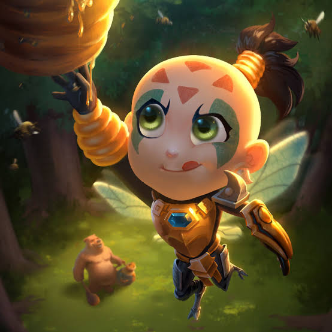
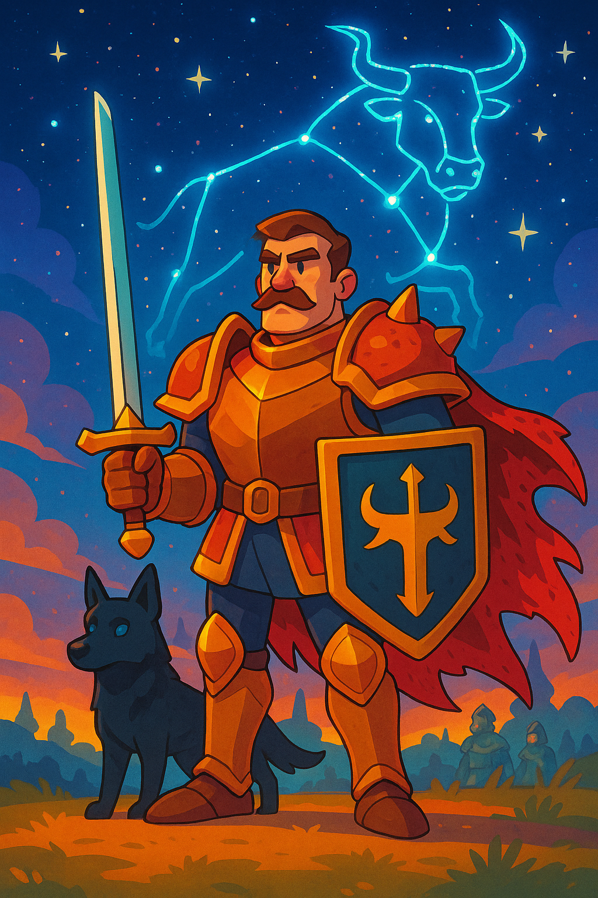
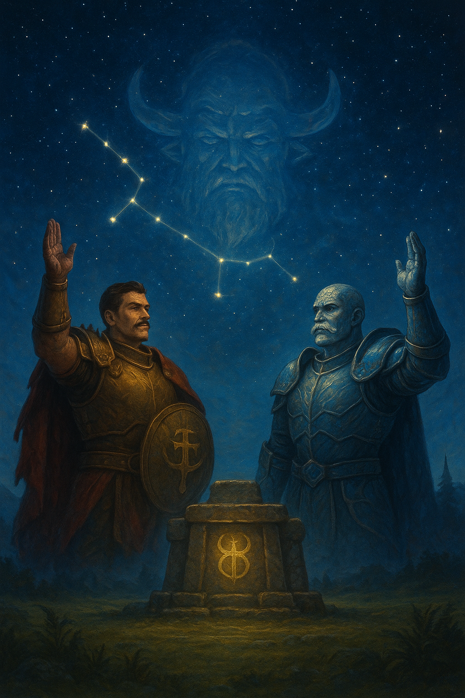
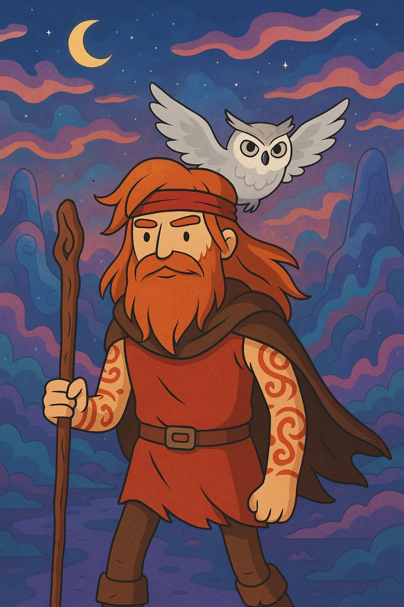

## Carnotauros Carmesí.

>### Ah Mucen Kab

*Ah Mucen Kab*, o *Abeja* para los amigos, es un _gnomo ranger_, último miembro de una tribu que fue aniquilada por un grupo de orcos. Desde entonces, ha vagado por Faerún protegiendo el último tarro de miel de su aldea, buscada por elfos y orcos, pues posee propiedades mágicas de efectos desconocidos.

Junto a él, viaja una colmena de abejas que lo asisten en combate y lo protegen de sus enemigos.

            
        

>### Aldebarán

*Aldebarán* es un _clérigo humano_ de Kiri-Jolith, deidad del honor, la obediencia y la justicia. Adoctrinado por su padre en los lineamientos de la Orden de la Espada, Aldebarán busca llevar la palabra del General Inmortal a todos los rincones de Faerûn, erradicando el mal y la corrupción dondequiera que se encuentre.

Él cree que aquellos que se desvían del camino de la justicia deben ser corregidos, y no duda en usar la fuerza para imponer la creencia en las leyes de Kiri-Jolith.

            
        

>### Camus

*Camus* es un *Goliath Paladín*, antiguamente seguidor de Thrym, dios de los gigantes helados. Hasta que en un combate en el desierto, uno de sus enemigos atravesó su pecho con su poderosa cornamenta, dejándolo al borde de la muerte. 

Fue ahí cuando Aldebarán, al que había conocido minutos atrás, salvó su vida, ofreciendo su alma al servicio de Kiri-Jolith, rompiendo su conexión con Thrym, llenando su mente con dudas y arrepentimientos, tratando de descifrar la forma de librarse de esta fe impuesta.

            
        

>### Palurdo Mockingbird

*Palurdo* es un *Firbolg Druida* originario del Bosque Alto, que ha dedicado su vida a proteger el equilibrio natural. Su vida ha estado marcada por el deber y la pérdida, pues durante un ataque de ogros, su aldea fue destruida y él sepultado entre los cuerpos de sus allegados, fue el único sobreviviente. 

Desde entonces, ha vagado por el mundo, buscando restaurar el equilibrio y proteger a los que no pueden defenderse. No busca la fama, la fortuna ni la venganza, lo único que lo motiva es su impulso de ayudar a quien lo necesita.

            
        
